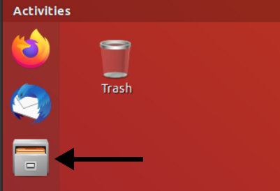
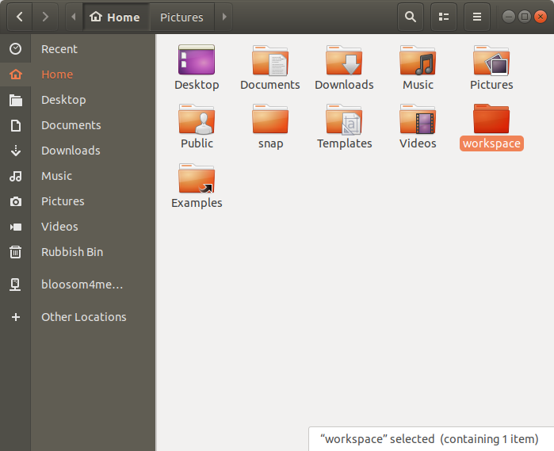
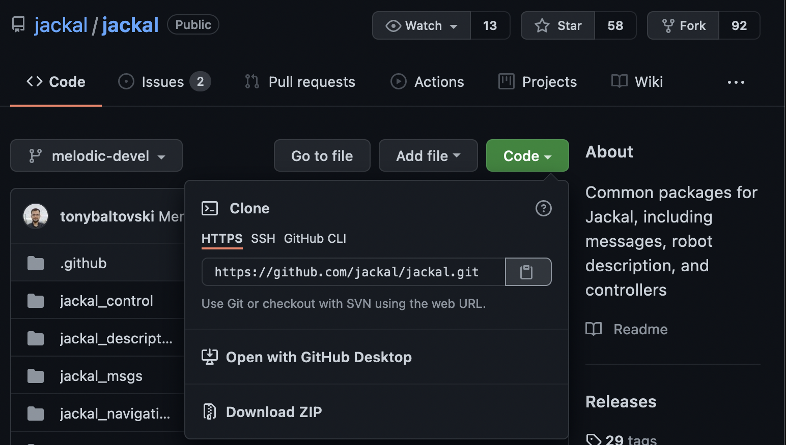
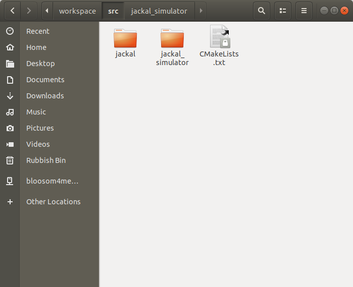

_Disclaimer: Many links to external sites, such as youtube and other online guides, will be used. These were not created by the creators of this guide._

**This is part 4 of a 5 part series going through the installation and application of Linux and the robotic operating system(ROS). These documents were created by Toluwani Soboyejo, Abdu-Allah Awad and Jessica Paterson. If you find mistakes in the documents please let us know so changes can be made.**

# Beginner: Folder Structure

Aims:

* Understand where packages are usually stored when downloading with `sudo apt install` 
* Understand why a workspace is used and how to create one
* Understand how to download packages/repositories from GitHub 

## Concepts to Understand
The default file browser on Ubuntu 18.04 is called Files. You will find it in the dock on
the left hand side of your screen (the icon which looks like a file cabinet).



Clicking on it will show you the folders of the system - if you're used to navigating Windows files then you may be familiar with the set up. What is different in Linux is the file structure of the operating system.

So far, we have been downloading packages from the internet using the `sudo apt install` command. But where have they been stored? If followed the instruction in the installing ROS guide to source the ROS melodic setup.bash file in your .bashrc file, then you should be able to find where all of the packages you installed by entering the following command into the terminal:
```
echo $ROS_PACKAGE_PATH
```
The output of this should be:
```
/opt/ros/melodic/share
```

This is at the default ROS install directory and it is owned by root (the operating system) - you shouldn't be editing packages here. They are read only, if you do edit them using `sudo` or by changing the file permissions, your changes will be overwritten if a new update is released in the apt package repository.

Ultimately, a simulated robot is a bunch of packages - so how should you take a package and edit/modify it? To do this you need to create your own Catkin Workspace.

*We will be using the words **folders** and **directories** interchangeably. As well as, **"catkin package"** and **"package"** interchangeably*

**Catkin Workspace:** a directory (or folder) where you can modify existing catkin packages or create new ones and connect packages together. It will contain at least three main subdirectories (sub-folders): build, devel and src subdirectories.

**Catkin Package:** building up from our definition of a package from the previous tutorial, a catkin package is a folder that at least has a "CMakeLists.txt" file and a "package.xml" file.

**Note: you can have multiple catkin packages in a single catkin workspace.**

**Repository:** *in the context of these tutorials* a folder containing more folders and (mainly) other packages.

You build your workspace in three parts: 
1) Creating catkin workspace 
2) Adding the packages you wish (or creating them) 
3) Building the workspace

## 1) Creating a Catkin Workspace 

Open a terminal and enter the following commands:
```
mkdir ~/workspace
```
*The `mkdir` command is to create a folder (it is short for make directory). The ~ sign is a shortcut for your home directory i.e. /home/<your_user_name>. So you have created a folder called workspace in your home directory.*. If you check Files now under `Home` you should see your new folder has been created:



You can also list the contents of any directory with the `ls` (short for list) command in your
terminal. The output should be similar to:

```
Desktop    Downloads         Music     Public     Videos
Documents  examples.desktop  Pictures  Templates  workspace
```

Enter the following command:
```
mkdir ~/workspace/src
```

This creates a folder called `src` in your workspace folder.

Enter the following command:
```
cd ~/workspace
```
*The `cd` command stands for change directory. In other words it is pointing the terminal towards the `src` folder.*

**Warning: Make sure you use this directory you have changed to above `workspace` for the following section. If you initialise catkin (in the next steps) in the incorrect folder it will give you an error we dont know how to fix yet.**

### What is catkin?

Before we create a package it is important to understand a little bit about what catkin is. Catkin is the custom build system for ROS. A build system is responsible for taking your raw non-static code (e.g. C++ files) and turning them into a usable format, for example executable programs. Popular build systems include CMake and GNU Make. Essentially Catkin extends CMake and makes it easier to use for ROS, which is why you will see files called CMakeLists.txt in your workspace.

There are two ways to interface with the catkin build system, `catkin_make` and `catkin_tools` and you will probably come across both at some point in your learning ROS journey and wonder what's going on. For now we are going to use `catkin_tools`.

First we need to install catkin_tools using apt:

```
sudo apt update
sudo apt install python3-catkin-tools
```

Now we can initialise the catkin workspace with:
```
catkin init
``` 
This will create a hidden directory called *.catkin_tools*, but you don't need to worry about the contents of this folder for now.

If we want to build a package we use the command:
```
catkin build
```

Even though there aren't any packages in the `src` folder yet, run this command now. It will still work. At this point, you will be able to see that two more folders have appeared in your Workspace folder: the build and devel folders (sometimes a log folder is created as well). If you run:

```
ls -a
```

*Adding `-a` to ls shows all the files in the folder, including the hidden ones.*

You should see the output:

```
.  ..  build  .catkin_workspace  devel  src
```
*On Unix systems you always have two hidden folders `.` and `..`, they stand for the current directory and the directory one level up respectively. For example, if you want to change directory to the one above you could type* `cd ..`

## 2) Adding your packages

### Downloading from Github

Github is a common platform for software developers. It allows for one to upload and share code easily. Many developers and institutions use Github to share their work and it is highly likely that this will be the place whereby you will be downloading robot sims and ROS packages.

To do this, you will need to install git tools first. Enter the following commands in a new terminal:
```
sudo apt install git
```
Next we find either a repository (folder with a bunch of packages) or generally packages that you want to download and edit. In this case we have identified the jackal robot repository at the following website address: 

https://github.com/jackal/jackal

If you click in each folder - such as the jackal_control - you will see that they have a CMakeLists.txt file and a package.xml. This means that the jackal_control folder is a **package** as it has the .xml and CMakeLists file.

If we wish to copy the whole jackal robot repository (i.e. all the packages found at that address) and edit it, then we need to take it into the src folder of the catkin workspace. We will use the same workspace created above. Open a new terminal and enter the following commands:

```
cd ~/workspace/src
git clone https://github.com/jackal/jackal.git
```
*What we have done here is entered into to the src folder of the workspace we made and
used the **git clone** command to download the repository from Github.*

Note that the URL we have used to clone the repo is the address of the repo with a .git at the end. This is the https clone address, you can clone by other means as well, and you can always find the correct URL to copy and paste by clicking on the green clone button in the root directory of any github repo:



Let's add another repository as well:
```
git clone https://github.com/jackal/jackal_simulator.git
```

At this point, if you look in your files, you would realise that the folders are all in the repository named `jackal` and `jackal_simulator` stored in the source folder of the workspace.



## 3) Building the workspace

Now that you have added the packages you wanted (or made your own packages) you need to build the workspace. 

From the same terminal, enter the following command:

```
catkin build
```

*Because you ran the command* `catkin init` *earlier you can call* `catkin build` *from any directory. If you skipped this step earlier you may get an error here.*

## Further Reading
* [Catkin tools read the docs page](https://catkin-tools.readthedocs.io/en/latest/)
  *Further information about catkin tools commands, including a cheatsheet and
  quick start guide*
