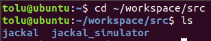
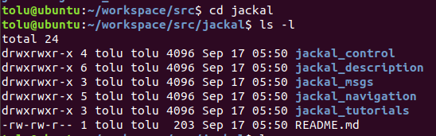
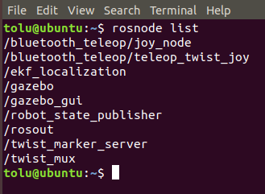
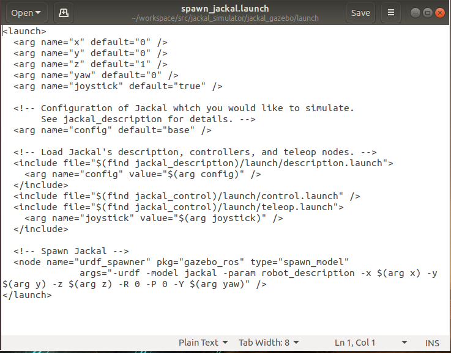

_Disclaimer: Many links to external sites, such as youtube and other online guides, will be used. These were not created by the creators of this guide._

**This is part 5 of a 5 part series going through the installation and application of Linux and the robotic operating system(ROS). These documents were created by Toluwani Soboyejo, Abdu-Allah Awad and Jessica Paterson. If you find mistakes in the documents please let us know so changes can be made.**

# Beginner: Understanding Files

Aims:

* Understand the basics of each of the file types in your repository 
* Know where to go to learn how to develop/create your own files
* Know how you would go about making your own package

## Concepts to understand

We know that a workspace is used as an environment to edit packages. Packages include a .xml file and a CMakeLists.txt file. Within these packages you will see that there are written texts of code that link to different files and packages in different ways. 

When you launch ROS

## Investigating the Files further:

Open a terminal and navigate the terminal to where you cloned the jackal repository.

```
cd ~/workspace/src
```
Then enter:
```
ls
```
You should see the all of the folders and files that are included in that src folder listed in the terminal. 
*Using the **ls** command is a quick way viewing the files where the terminal is pointing towards. This is a good alternative to opening the folders using your mouse - when you have mutliple folders nested in folders it would be much quicker to view the list of files from the terminal. This was done in the previous guide as well*



Now enter:
```
cd jackal
ls -l
```
You will see the list of folders and files that are within the jackal repository - listed vertically due to the addition of `-l`. The folders are indicated in blue - you can direct the terminal path into the folder listed by typing the command **cd [folder_name]**. For example `cd jackal_control`.



*Remember the jackal is a repository with packages within it. The repository is placed in the src folder of the workspace.* 

## Running whats in your workspace

After you have built your workspace with all of the packages included, you will probably want to run whatever is in your workspace. Your workspace will have multiple packages included and so you need to do two things:

1) Source the workspace (you do this for every new terminal you open that you want run the packages from)
2) Find the launch file you want to use

### 1) Sourcing the workspace

First, we have to open the terminal and source the workspace. To do this the new terminal needs to be directed to the setup.bash file of the catkin workspace. This setup.bash file is in the devel folder of the catkin workspace hence, open a new terminal and enter:

```
source ~/workspace/devel/setup.bash

```

You will have to **source the workspace for every new terminal** if you wish to run content from the workspace.

### 2) Launch files

A launch file is used start up a ROS Master and run multiple nodes (**Reminder** a node is simply an executable file within a package). To use the terminal and do something with your packages, you will need to find the launch files associated with it. Not all packages will necessarily have launch files. Nonethless, you will usually find in the instructions of the package/description what the name of the launch file is that will simulate the robot.

```
roslaunch jackal_gazebo jackal_world.launch
```
*As we mentioned, the **roslaunch** command is used to run multiple nodes. It also automatically runs the ROS Master that allows for nodes to connect with each other. The format of the command is: **roslaunch [package_name] [file_name.launch]** . ie in the above example, the jackal_gazebo is the name of the package (which has the .xml file and the CMake.txt file by definition) and the jackal_world.launch is the launch file needed for the command.*


You will see that the Gazebo programme has now launched and that the jackal robot has spawned in a new world.

To view all the nodes that are available in the ROS Master, you can open a different terminal and type the following command:

```
rosnode list
```
You will now see listed all the nodes that the launch file created from the package. Remember that nodes are either publishers or subscribers.



We know a launch file is used an needed to start up a ROS Master and run multiple nodes (**Reminder** a node is simply an executable file within a package the either acts as a subscriber or a publisher). 

Let's open up the launch file. You can do this by navigating using the file window to the package and double clicking the file or by using the following command from a terminal:
```
cd ~/workspace/src/jackal_simulator/jackal_gazebo/launch
ls
gedit spawn_jackal.launch
```
*The **gedit** command is used to open up the file in a text editor*

You will see code written in HTML format:



## Creating packages and nodes

You may want to create your own package.

To do this, you would use the **catkin_create_pkg** command that has the following format:
```
catkin_create_pkg [package_name] [dependency 1] [dependency 2] [dependency 3]
```

Using the workspace, you would open a terminal and enter the following commands:

```
cd ~/workspace/src
catkin_create_pkg package_101 roscpp std_msgs
```

*The command **catkin_create_pkg** creates the package and the **package_101** details the name of the package. **roscpp** and **std_msgs** details the dependencies.*

Dependency here refers to ROS specific software packages that are needed to build the package in the previous line of code we had **roscpp** and **std_msgs** as dependencies - ie the package we are creating is dependent on the **roscpp** software package (special packages in the ROS system directory)and the std_msg software package to write the code of our nodes.

*The roscpp software package is an implementation that will allow us to use c++ code to interface with the topics, services and parameters, std_msgs is the software package that allows us to use the familiar data types (eg string, uint32, int etc...). If you wanted to use python code for this, you would replace roscpp with rospy.*

If you wanted to write the code for the nodes using python, you would replace **roscpp** with **rospy**.

To practice writing your own node for the jackal, follow the tutorial on the following page from the section **Writing your own publisher** onwards.

## URDF files

URDF stands for Universal Robot Description Format. It describes the robot's physical description to ROS. You can find the URDF files relating to the jackal robot by searching the workspace for urdf or by the following pathway in the terminal:
```
cd ~/workspace/src/jackal/jackal_description/urdf
ls
```
If you open one of the files (either by using **gedit** command on terminal or by double clicking the file with your mouse) you will likely see something similar to this:


As you can see, the file is written in HTML format like the launch files.

## Further resources to learn more  about ROS:

## Further Resources and Tutorials

Now that you have a basic understanding of how to use Linux and ROS, you are better prepared to follow some further tutorials that will build up on your foundations.

### ROS Wiki Tutorials: 

Link:  http://wiki.ros.org/ROS/Tutorials

These are the official tutorials from the ROS Wiki. From this point forward, it is advisable to start the beginner tutorial onwards to revist some concepts discussed in this tutorial and to it. As it is the official site, it is kept up to date and comprehensively details ROS.

### ROS Robot Programming - Fiarchild and Harman 

Link: https://drive.google.com/open?id=1H48MY7bUYBnqQ-orHN9U2pBoo43jAd8e

This includes both a free ebook as well as a free video course. It is advisable for those who want to delve into a much more comprehensive explanation of ROS concepts.

### ROS Robotics by Example Second Edition
 
**Note that this is for ROS Kinetic and so some of the commands may bit be up to date.** 
The contents of this book is led by examples and hence makes it practical for those who want to start creating straight away.


