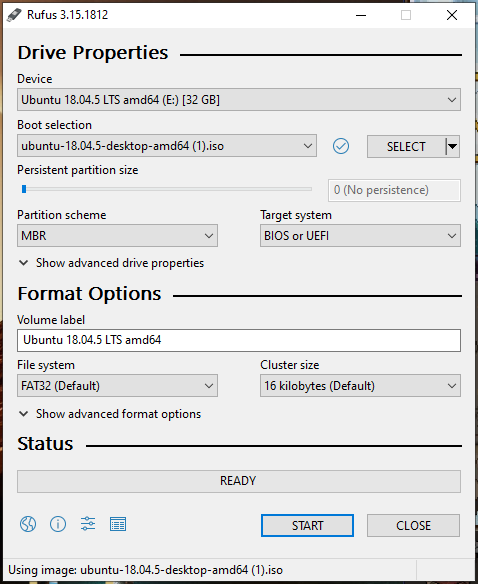
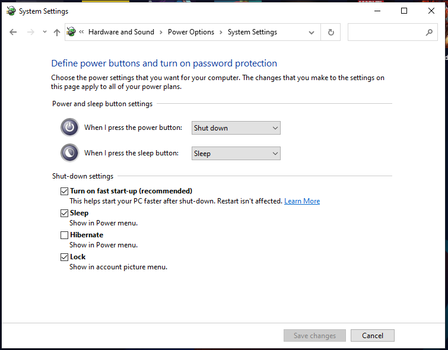
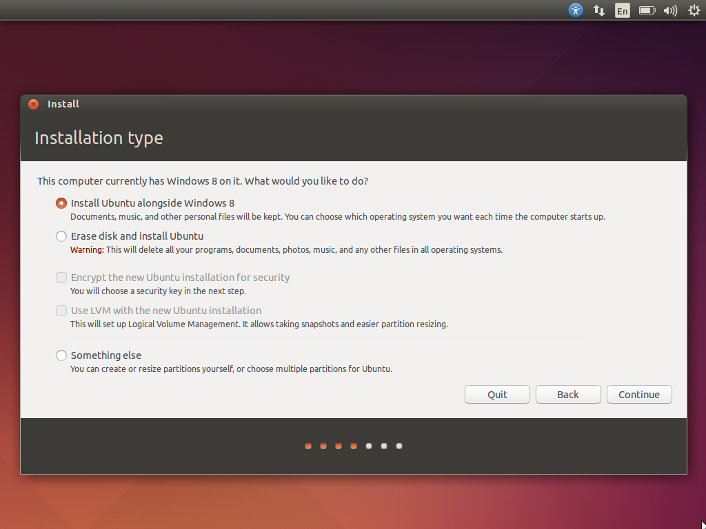
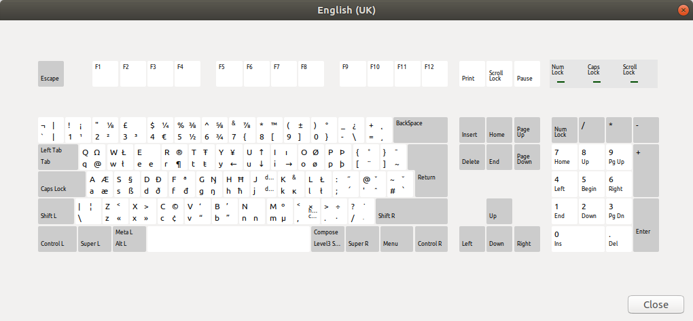
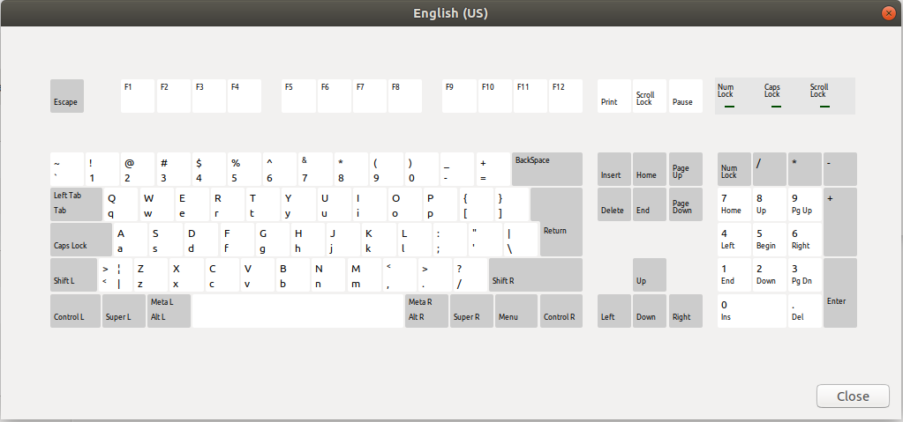

*Disclaimer: Many links to external sites, such as youtube and other online guides, will be used. These were not created by the creators of this guide 

# Contents:
1. [Installing Linux](https://bit.ly/3joBWXB)
    1. [Installation via dual boot / Full installation](https://bit.ly/3BoJKP6) 
        1. [Preparing the bootable USB stick](https://bit.ly/2Wy5yZO) 
        2. [Booting from the USB](https://bit.ly/3yrQda4) 
        3. [Linux Install](https://bit.ly/2Wz8wgN) 
        4. [Common issues](https://bit.ly/3sUXRc7) 
    2. [Installation via virtual machine](https://bit.ly/38pYhO2) 
        1. [Common issues](https://bit.ly/3gKCnK9) 
2. [Linux Cheat sheet](https://bit.ly/3DqQv4X) 
    1. [Keyboard shortcuts](https://bit.ly/3BsS4O5) 
    2. [Keyboard layout](https://bit.ly/3ypsbwn) 
3. [Glossary](https://bit.ly/3sTsOgM) 

# Installing Linux
In this guide we will be going through how to install and run Linux Ubuntu 18.04 in 3 ways. 

1) Via **dual boot** on your Personal computer(PC) - this is where you would install the Linux operating system(OS), such that it runs the Linux OS as well as your own OS. You can switch between the operating systems at reboot.
2) Via **full installation** on your PC - this is where you would install the Linux OS as the **only** operating system running on your PC. **Warning:** this will wipe out all exiting OS, programs, files etc...
3) Via a **virtual machine(VM)** running on your PC - here you would download VM software that emulates the Linux environment. You can also download VM's that have both Linux and the Robotic operating system(ROS) installed. 

On the surface this may seem like an easy task but there are a lot of issues that you may face along the way. We will highlight some of the issues we encountered and offer solutions, so you dont have to go through the stress that unknown errors bring. Further help will be provided at the end of this guide to make using the installed linux an easy process. **p.s. Ubuntu 18.04 is required to run ROS melodic, So be careful not to install the shiny new version of Ubuntu as you will have issues running ROS melodic.**

## Options 1 & 2 (Installation via dual boot / Full installation)

To use either of these methosd you will need:
1) Your PC.
2) A USB stick with a minimum storage of 4 GB (Check on USB or through PC).
3) A bootable software, we personally recommend **Rufus** - this can be found by following this link: https://rufus.ie/en/ and selecting the latest stable version to download.
    

It is advisable to make backup copies of all of your files before proceeding with the download and installation of Linux OS. This could be done by **creating a system restore point** (search google for instructions) or by saving important files onto a **USB**, **Google drive**, or another form of your choosing.

### Preparing the bootable USB Stick
To use the USB as a medium to install linux, the USB must first be made bootable. This process is described below. **Warning:** The contents of your USB will be deleted, so make sure it is empty or you have a backup of it's content.
1. Download Ubuntu 18.04 **desktop image** by clicking the following link: http://releases.ubuntu.com/18.04/ and selecting the appropriate **desktop version** for your PC. This will download a **.iso file** onto your PC.
    
3. Plug in your USB drive and open the Rufus software
4. Make sure that the following is selected for each section:
    * Under **Device**, select your **USB drive**.
    * Under **Boot selection** select and navigate to the **.iso Ubuntu desktop image** that you downloaded in step 1. 
    * Under **Partition scheme** select **MBR**.
    * Under **Target system** select **BIOS or UEFI**.

        

4) Click **start** and wait until the process is complete. You may get a prompt informing you that the disk image is an **'iso hybrid'** and a recommendation to install it as a .iso image - **choose the .iso image option**. Rufus may also give you a prompt seeking permission to download further files - **click agree/yes**.

Once completed, you will have a bootable USB drive that you can use to run and install Linux.


### Booting from the USB 
To install the Linux operating system, you will need to have the USB drive plugged in while booting up the PC. You will also need to know which key to press to enter the Boot Menu. Once the computer has begun to start up you will need to click that key like your life depends on it.

These keys are usually either **F1**, **F2**, **F10**, **F12** or **Del**. If you don't know the key you may be able to find out by googling **BIOS key for [*input your computer model*]**. Or just try each of the ones we mentioned at least once.

If your PC isn't taking you to the Boot Menu even though you are pressing the correct keys - this could be due to your PC starting up too quickly. Here are a few methods to get around this:
1) Firstly, the easiest method is to click **restart** (on the desktop start menu) while holding the **shift key**. This will take you to a menu entitled **Choose an option** where you will need to press **Troubleshoot** > **Advanced options** > **UEFI Firmware Settings** and proceed to restart. This will automatically reboot the system into the BIOS/ UEFI. This is the first tip described in this video: https://youtu.be/yPLvBo5UCv0 - *thankfully u only need to watch the first minute*.
2) Alternatively, if u wish to try frantically pressing a key again, you can stop "fast start-up" by navigating to your **control panel** then selecting **Hardware and Sound** > **Power Options**, then press **"choose what the power buttons do"** (located on the left section of the window), this will take you to the **System Settings**. Finally, click the **Change settings that are currently unavailable**, uncheck the **Turn on fast start-up** and click **save changes**. This should give you an opportunity to press the relevant keys to enter the Boot Menu.
    
4) If the above two methods have not solved the issue then the PC can be forced to go to the menu described in the first method by turning the PC off completely through holding the **power button** until loss of power. Then turn on and off again once it begins to load until the computer begins to run a **recovery process**. usually after repeating the process 3 times. **Warning: This is a last resort and it could be done a lot easier by using the first method**.
5) For those still struggling here is another video to help reach the BIOS: https://youtu.be/IMr5-mEbhTs.

Once you've found yourself at the Boot Menu(in the BIOS) you will either need to move the **Boot from USB drive** to the **top of the list**, or select **USB drive**.

If the install for linux doesn't appear and the computer still runs windows, you can temporarily disable the **windows boot manager** in the BIOS, then try again.

### Linux Install
Once your PC has booted from the USB drive, you will see a purple GNU which you can use to select to boot Ubuntu.

You will be given the option to either run Linux without installation, or to install Linux. Selecting install Linux will take you to the installation guide. You can then pick to install Linux alongside your OS or to erase your disk and install Linux (this will wipe out your current OS along with any files you have such that the only thing is Linux).


**Warning:** We recommend choosing whether to run linux alongside your OS, or to erase the disk, before picking an option, as it will be extremely difficult to change your mind after the process is done. You have been warned!!

### Common Issues 
**Wi-fi not connecting:** you may find that, following installation, Ubuntu doesn't want to connect to the internet. A few solutions to this include:

1) Simply restarting the computer - this could work if your Linux recognises other networks but fails to connect to them.
2) Connecting the PC to your internet via a wired connection and downloading updates - once connected, open the terminal (by hitting Ctrl+Alt+T) and type into the terminal
```
sudo apt update && sudo apt upgrade 
```
* reboot the Linux. 
* You may encounter an error stating: **"unable to acquire the dpkg frontend lock (/var/lib/dpkg/lock-frontend), is another process using it?"**. If this error depicted comes up there are a few possible options to try, this link goes through each of them: https://itsfoss.com/could-not-get-lock-error/. Though it is likely you will just need to wait a while for background updates to complete.


## Installation via virtual simulation
If preparing a bootable disk and running it on your PC is too much of a hassle, then you could, alternatively, run via a virtual simulation on your PC. To do this, you will need to download a virtual machine emulator such as **VMware**.

1) Download **Ubuntu 18.04 desktop image** by clicking the following link: http://releases.ubuntu.com/18.04/ and selecting the appropriate desktop version for your PC. This will download a .iso file onto your PC.
2) Download **VMware Workstation Player** from the following link: https://www.vmware.com/uk/products/workstation-player.html p.s. You want to download the suitable one for your current OS. For example the **windows VM** for a **windows OS**.

4) Run VMware and, once it has loaded, select **Create a New Virtual Machine**.
5) Select **Installer disc image file (iso)** and browse for the Ubuntu desktop image then click **Next**.
6) Follow the installation guide - you will also be asked to specify the disk size and whether you wish for the virtual disk to be stored as a single file or as multiple files. Here you could just follow the recommended or default settings.

### Common Issues
You may find that the virtual disk keeps crashing due to a few issues
* Not enough space on hard drive - remedied by freeing up space on your hard drive
* You have an anti virus software installed that is conflicted with VMware - remedied by changing the anti virus software
* You haven't enabled virtualisation in your Bios settings (common if you have a new computer) - reboot computer and press either the *F1*, *F2*, *F4* *Delete* or the *Esc* keys.
* Too slow - you may find that navigating the basic Linux interface is slow and that program is too slow. You can attempt allocating it more RAM by 

# Linux Cheat Sheet
Upon installing Linux it may seem daunting to navigate your way around, but worry not we have provided a few handy tips, directions and advice to get you accustomed to linux as quickly as possible.

## Keyboard shortcuts
As some may not have used Linux before we have prepared a few important key shortcuts that may come in handy:
* **ctrl-alt-T** : open terminal (can also left click in desktop)
* **ctrl-shift-V**: paste in the terminal
* There is also a list of all the keyboard shortcuts for linux located at **Settings** > **Devices** > **Keyboard**.

## Keyboard layout
Sometimes after installing linux you may find that certain keys are in a differnt position to what you are used to. This may be because the linux you have installed is using a different keyboard layout. 

In order to change your keyboard layout go to **settings** > **Language and Region** > Then click the **'+'** sign and add the keyboard in the languague of your choosing.

In the case that you have special characters in your password and are unable to login due to the change in keyboard, we will attach mappings of important keys for both the **English(US)** and **English(UK)** keyboards.

**UK English keyboard:**


**US English keyboard:**


# Glossary
**BIOS - Basic Input/Output System**: the BIOS (pronounced bye-oss) is a ROM chip found on motherboards that allows you to access and set up your computer system at the most basic level. 

**GNU** : The GNU is an extensive collection of free software, which can be used as an operating system or can be used in parts with other operating systems.

**OS - Operating system**: The low-level software that supports a computer's basic functions, such as scheduling tasks and controlling peripherals.

**PC - Personal Computer**: a computer designed for use by one person at a time.

**ROS - Robotic Operating System**: ROS is an open-source, meta-operating system for your robot. It provides the services you would expect from an operating system, including hardware abstraction, low-level device control, implementation of commonly-used functionality, message-passing between processes, and package management.

**UEFI - Unified Extensible Firmware Interface**: provides the same functions as the BIOS

**VM - Virtual Machine**: A Virtual Machine (VM) is a compute resource that uses software instead of a physical computer to run programs and deploy apps.
