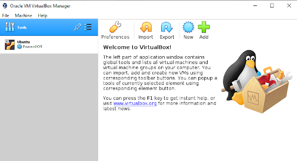

*Disclaimer: Many links to external sites, such as youtube and other online guides, will be used. These were not created by the creators of this guide.*

**This is a supplement to part 1 of a 5 part series going through the installation and application of Linux and the robotic operating system(ROS). These documents were created by Toluwani Soboyejo, Abdu-Allah Awad and Jessica Paterson. If you find mistakes in the documents please let us know so changes can be made.**

# Installing Ubuntu 18.04 in Virtual Box

This is a guide for anyone who has to run an Ubuntu Virtual Machine (VM)) in
[VirtualBox](https://www.virtualbox.org/).
It is recommended that if you have a choice of which virtual machine to use, that you use
VMPlayer (Windows, Linux) or VMFusion (Mac *Intel only*). Instructions on how to use
VMPlayer can be found in [1. Installing Linux](1.%20Installing%20Linux.md).

Also please
make sure that you have **enabled virtualisation in your BIOS**. Guidance on how to do so can
be found in [1. Installing Linux](1.%20Installing%20Linux.md). If you have an Intel Mac
you can ignore this.

## Download and Install VirtualBox

If you are on a machine with an IT managed software centre, download and install VirtualBox from there
in the usual way.

For everyone else, go to the VirtualBox [Downloads](https://www.virtualbox.org/wiki/Downloads) page and
download the install package for your host machine. Note that your PC is referred to as the
host, and the VM as the guest. So if you have a Windows PC and run an Ubuntu VM, you have
a Windows host with an Ubuntu guest. Please also note that VirtualBox is not compatible
with M1 Macs.


## Installing the Ubuntu VM
If you haven't already done so, [download](https://releases.ubuntu.com/18.04.5/) the Ubuntu 18.04.5 desktop iso. 

Open VirtualBox. You should see a welcome screen similar to below (if you are asked to
update VirtualBox please do so).


Click on New (the blue cog icon, next to the big green cross), or go to Machine -> New.
This will open the Create Virtual Machine window. Give the VM a Name, (it can be any name
you like), set the type to Linux, and the Version to Ubuntu_64.


The next screen allocates memory for the VM. How much you allocate will depend on your PC.
Most PCs have a least 4 GB of memory, do not allocate all of your memory to the VM as this
will slow down or crash your PC. You can increase or decrease the amount of memory
allocated later.

In the screenshot below you can see VirtualBox has detected that the host machine has
about 8 GB of available memory and roughly 4 GB is being allocated to the virtual machine.
The slider is colour coded to guide your choice of memory allocation, try to stay in the
green.


The next stage is the Hard disk, make sure 'Create a virtual hard disk now' is selected
and click Create. This will take you to the Create Virtual Hard Disk Setup. Accept all the
default options until you come to the **File location and size** screen. 


Here you need to make sure you allocate enough disk space to install Ubuntu, ROS and
Gazebo. The default is 10 GB which too small! This is the minimum required for just Ubuntu
Desktop. If you have enough disk space on your PC give at least **25 to 30 GB**. You
cannot increase your VM's hard disk size later, so you need to make the right choice now. 

After you click Create you should see a new VM in the left sidebar of the VirtualBox
Welcome page.



Double click on the VM to power it up. You will be asked to select a start up disk. This
is the Ubuntu iso you downloaded earlier. After you press start Ubuntu will boot into the
Install Wizard. This may take some time. You will notice that even if you maximise your
screen the virtual machine will not resize. We will fix that later, for now you will have
to deal with a tiny screen.


Click on install Ubuntu and proceed to the Keyboard layout screen. Make sure you select
the correct keyboard layout for your host PC otherwise you may have issues entering your
password.

At the Updates and other software screen it is recommended to chose a minimal
installation, especially if you have not allocated a lot of space to your virtual
hard drive. 


For the rest of the installation simply accept the defaults. Do not panic when it says it
is going to erase your disk and install Ubuntu, it is not going to erase your host computer's
hard drive, just the virtual disk. When it comes to choosing a password you need to make
it memorable, even if you chose to Log in automatically, as you will be using it a lot
later to install software.

After the installation completes you will need to restart. Click restart now and wait
until you see the remove installation medium screen. Press enter on your keyboard and
Ubuntu should now boot. If it does not please go to the [troubleshooting
guide](#Troubleshooting) at the
bottom of the page.


## Fixing the Small Screen Issue
To fix this issue and improve usability in many other ways you need to install
VirtualBox Guest Additions. This is collection of drivers for VirtualBox. To do so whilst
the VM is running, go to `Devices -> Insert Guest Additions`. You
will be prompted to download Guest Additions.

Once guest additions is downloaded it should automatically be mounted as a CD-Rom on your
Ubuntu desktop. You will see a CD icon named something like,
**VBox_GAs_X.X.XX**, (where the X's represent the version number) in the top
left corner of the desktop under the Rubbish Bin (if not try restarting the VM).


Double click on the CD icon. This will open your file browser. You will see a lot of
files and folders and a yellow bar on top these, which will contain a `Run
Software` button. This will run the autorun.sh script in your terminal to install the
VirtualBox drivers you need.


After this scripts completes reboot the machine. Since you already have a terminal window
open, the fastest way to reboot your VM is to enter the command:
```
reboot
```
into your terminal.

When your machine reboots you should be able to maximise the VirtualBox window and have
the VM's screen resize as well. Sometimes this is a bit slow and you may have to try
maximising and restoring the window a few times. You may also have to fully login to Ubuntu
for it to work properly.

### Enable Copy and Paste between the host PC and the Linux box
By default VirtualBox disables copy and paste between your PC
and your VM. You can change this behaviour in the settings. First completely power
off the Ubuntu VM, if it is running.

Once the VM has powered down completely. In the main VirtualBox window, select your VM by 
left clicking on it once.

The right hand side of the screen should change to show all the information about your VM.
Click on Settings in the toolbar which should look similar to the one shown below, or
press `Ctrl-s`.


In General, navigate to the Advanced tab. Under Shared Clipboard, select your desired
Clipboard settings. If you want to only be able to paste into the VM from your own
machine, select Host to Guest, if you want to be able to copy and paste in both
directions click Bidirectional.

## Troubleshooting
These are some of the most commonly encountered issues with VirtualBox. If you know of any
other issues and their fixes, which you think should be documented here 
please make a pull request.

### What do if Ubuntu does not boot or becomes unresponsive/lags a lot 
Power off the VM. Simply close the window and then select Power off the machine when asked
what you want to do.

Once the VM has powered down completely. In the main VirtualBox window, select your VM by 
left clicking on it once.

The right hand side of the screen should change to show all the information about your VM.
Click on Settings in the toolbar which should look similar to the one shown below, or
press `Ctrl-s`.


Navigate to the System in the left sidebar and then click on the Processor tab. In some versions of VirtualBox the
default number of Processor CPUs is set to 1. Increase it to at least 2. If you find your
VM is unreasonably slow when running Gazebo simulations, you may wish to increase this
number further.


*The Motherboard tab is where you can increase the Base Memory or the VM RAM. If you feel
that the RAM you assigned when you initially set up the VM wasn't correct, this is
where you can change it.*

Simply increasing the number of CPUs, may be enough to boot the machine, but whilst you are here it is worth increasing
the video memory. To do so navigate to Display and increase the Video Memory. Usually
the default is the bare minimum of 1 MB, don't be afraid to set it to the maximum or be
conservative and stick to a number a little bit lower. This will save you a lot of pain
later, when Gazebo starts having weird problems that are hard to reproduce and
debug.


### My Mouse isn't working outside the virtual machine 
**If you cannot use your mouse** press the ctrl key on the right hand side of your
keyboard, or the right Command key on a Mac. If you do not have a ctrl key on the right
hand side of your keyboard and you are on Windows press `ctrl alt Delete` that should let
you kill the VM or VirtualBox. If you are on a Mac try `Option + Command + esc` to
force quit VirtualBox.

*When you install Virtual Guest Editions this problem usually goes away, as one thing
Guest Editions improves is the integration of the mouse between guest and host.*


### What to do if VirtualBox gives Error VERR_VMX_NO_VMX on Windows
This is due to virtualisation settings on Windows machines. If you are sure that you have
virtualisation enabled in your BIOS this error is most likely caused by Hyper-V. In
general VirtualBox does not work well, or at all, in Windows if Hyper-V is enabled. Using
VirtualBox 6 (the current version at the time of writing) with Hyper-V enabled is an experimental feature and performance is much
worse, so it is recommended to disable Hyper-V where possible. *If you use WSL2 or
Docker for Windows you NEED Hyper-V to be enabled.*

If your laptop is managed by an IT department you may wish to contact them for support at
this point, especially if you have downloaded and IT managed install of VirtualBox. To
disable Hyper-V usually requires an administrator account.

Instructions on what to do about this error can be found at the following external links.
**The disclaimer about following external links from the top of this document applies.
These methods have not been fully tested by the authors of these guides and may be out of
date or not work for every version of VirtualBox or Windows 10.**

* [Stackoverflow: How to disable Hyper-V in command
  line?](https://stackoverflow.com/questions/30496116/how-to-disable-hyper-v-in-command-line)
* [Superuser](https://superuser.com/questions/1391838/virtual-box-is-not-working-on-windows-10)
* [YouTube: Windows Hypervisor is causing issues using Virtual Box on Windows 10. How to Fix??
  (WSL2 Hyper-V)](https://www.youtube.com/watch?v=_2lsWjUY-A0)


## Further Reading
* [VirtualBox Manual: Chapter 3. Configuring Virtual Machines ](https://www.virtualbox.org/manual/ch03.html) 
  *Detailed information about all the various settings in the Settings menu*

* [VirtualBox Manual: Snapshots](https://docs.oracle.com/en/virtualization/virtualbox/6.0/user/snapshots.html)
  *How to save a snapshot of your VM in useable state that you can restore if
  something goes wrong later. Sometimes VMs get corrupted, it's a good idea to take a
  snapshot when you first setup the machine and install your basic ROS and Gazebo
  setup, to save you the pain of redoing it later if something breaks.*
